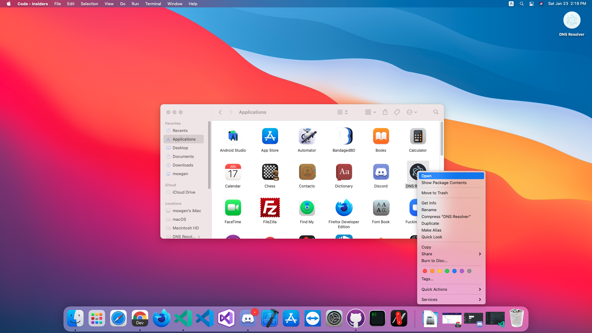
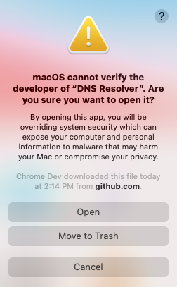

**다운로드/설치 전에 꼭 아래 설명을 읽어주세요!** && **Please read the instructions below before downloading/installing!**

# 설치(Install)

## Windows(64비트) && Windows(64Bit)

아래에서 exe 파일을 다운받고 실행하면 자동으로 설치돼요. 이떄 Microsoft Defender SmartScreen이 뜨면 고급 옵션에서 실행하기를 눌러주세요.
If you download and run the exe file below, it will be installed automatically. When Microsoft Defender SmartScreen pops up, click Run under Advanced Options.8

## Windows(32비트) && Windows(32)

아래에서 msi 파일을 다운받고 설치해주세요. 이떄 Microsoft Defender SmartScreen이 뜨면 고급 옵션에서 실행하기를 눌러주세요.
Please download and install the **msi** file below. When Microsoft Defender SmartScreen pops up, click Run under Advanced Options.

## macOS

아래에서 dmg 파일을 다운받고 마운트한 다음, 왼쪽의 YouTube Downloader를 오른쪽의 애플리케이션 폴더로 드래그해주세요.
Download and mount the dmg file below, then drag the YouTube Downloader on the left to the application folder on the right.

**__중요__**: 첫 실행 시 아래와 같은 창이 떠요. 
**__Important__**: The window below appears on the first run.

이 경우 Finder-애플리케이션-YouTube Downloader를 우클릭-열기에서 열기를 눌러주세요. (2번째 실행부터는 Launchpad를 이용하면 돼요)
In this case, press Finder-Application-Open YouTube Downloader under Right Click-Open. (You can use Launchpad from the second run.)

## Linux

권장되는 방법은 Snap을 통한 설치에요. 아래 버튼을 클릭해서 설치할 수 있어요.
The recommended method is installation via Snap. You can install it by clicking the button below.

하지만 아래의 방법을 사용할 수도 있어요.
But you can also use the method below.

Ubuntu/Debian: deb 파일 && deb Files

RedHat/Fefora/CentOS: rpm 파일 && rpm Files

Arch linux/Manjaro: pacman 파일 && pacman Files

을 다운받은 다음 OS의 패키지 매니저를 이용해 설치해주세요.
Download the and install it using the package manager of the OS.

Ubuntu/Debian: 파일 더블클릭(Double-click File) - 설치 혹은 `sudo apt install <파일 경로>`(Installation or `sudo apt install <File Path>`)

RedHat/Fedora/CentOS: 파일 더블클릭(Double-click File) - 설치 혹은 `sudo dnf install <파일 경로>`(dnf가 없을 경우 yum을 이용해주세요)
Installation or `sudo apt install <File Path>`(Please use yum if you don't have dnf) 

Arch linux: `sudo pacman -U <File Path>`

혹은 Ubuntu/Debian 리눅스의 경우 [PPA](https://github.com/team-int/ppa)를 통해 설치할 수도 있어요
Alternatively, Ubuntu/Debian Linux can be installed via [PPA](https://github.com/team-int/ppa).

# 업데이트(Update)

## Windows(64Bit, 32Bit)

업데이트가 있으면 자동으로 다운로드/설치되며, 이 경우 앱을 재실행하면 업데이트가 적용돼요.
If there is an update, it will be downloaded/installed automatically, and in this case, the update will be applied when the app is re-launched.

## macOS

macOS의 코드 사이닝 정책에 의해 자동 업데이트를 받을 수 없어요.
We cannot receive automatic updates due to the code signing policy of macOS.

## Linux

Snap으로 설치한 경우: `sudo snap refresh`로 업데이트할 수 있어요.
If installed with Snap: You can update to `sudo snap refresh`.

Debian/Ubuntu 계열: PPA를 통해 설치한 경우 `sudo apt update`와 `sudo apt upgrade`로 업데이트할 수 있어요.
Debian/Ubuntu family: If installed via PPA, it can be updated to `sudoaptupdate` and `sudoaptupgrade`.

다른 리눅스 배포판은 업데이트를 지원하지 않아요.
Other Linux distributions do not support updates.

English : Translator MadeGOD
